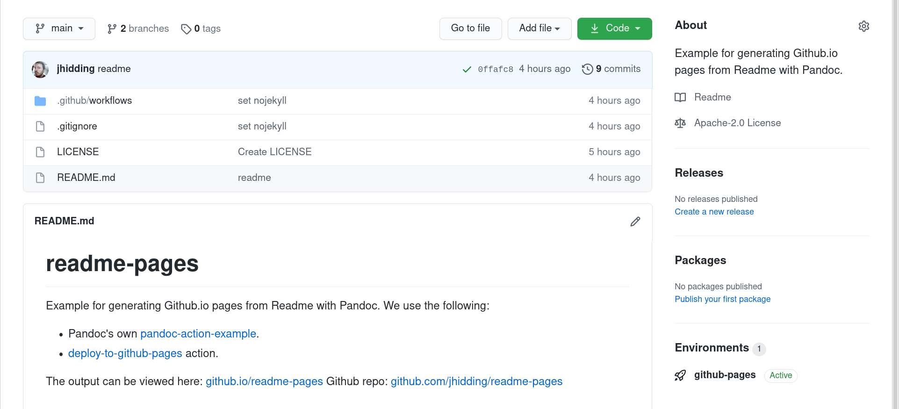

> This lesson can be taught as a replacement of the episode "Containers on the Cloud".
> Participants should have experience working with `git` and Github.
{: .callout}

Docker has become an industry standard in providing run-time environments to cloud services. This
lesson shows how you can use Docker images inside Github Actions. Our specific
example will show a
neat way to build a simple website that goes with any project you might have going.

# Github Actions
Github Actions are a means of automating repetitive task in maintaining software projects:

- Testing if your software works correctly (Continuous Integration)
- Building components for distribution to your users (Continuous Deployment)
- Building documentation

These are tasks that you could do on your own computer, but consider the following cases:

- Your software works on your computer, but you forgot to mention this one crucial package for
  correct operation.
- Your software used to work, but since the last update something broke.
- Someone else contributed to your package but didn't run the same version of the document
  converter: the documentation looks different now.

These are just some of the bad things that may happen.  To address these issues,
it is often desirable to have a consistent, controlled
environment in which to run these tasks, collectively known as CI/CD. Github can perform these
actions for you inside Docker containers. If your project is open source, this service is entirely
free of charge. Competing platforms have similar services for which the syntax may vary slightly,
but they are all grounded in the use of some form of containers (Docker or otherwise). We will
demonstrate the use of a Docker container in deploying a small website presenting a Github
project.

# Building Github.io pages with Pandoc
Suppose you have a Github project with a README and would like to turn it into HTML for a
Github.io page. A common problem in documenting and testing software is to keep relevant content in
a single location. In a Github project this location is the README, however it will look a lot more
professional if you also have a custom website where people can find downloads, documentation
etc. This website could become part of a larger portfolio of all your projects on Github.

It would be nice if such a page was updated automatically every time you update other
parts of the project.

A fabulous tool for building web content from Markdown files is Pandoc. You could call it the swiss
army knife of document conversion: it is very, very versatile. In this instance we will only use
its most basic operation. (If you are familiar with RMarkdown: Pandoc is what powers RMarkdown).

> ## Why Pandoc?
> There are other engines that can do this for you, but here are some features that win some people
over:
> - Supports citations (from BibTeX or CSL database)
> - Rendered equations (using MathJax, optionally numbered)
> - Code highlighting
> - Highly customizable
{: .callout}

We take you through the process of creating a project on Github from scratch and
convert the README to HTML and upload it to a separate `gh-pages` branch. First let's take a look at
what the end product will look like. We have a project ([example
here](https://github.com/jhidding/readme-pages)) with a `main` branch that includes a README.

{: width="90%"}

We can use Pandoc to turn this README into a simple static website.

{: width="90%"}

If we switch to `gh-pages` branch in Github we can see where this page is hosted.

{: width="90%"}

Only a `index.html` and `.nojekyll` (that prevents Github from creating a Jekyll page). So how do we
set this up?

## Create a Github Project
Create a github project with a short `README.md`. To do this:

- go to `github.com` and make sure you're logged in
- click the green "New" button at the top right
- clone the new project to your computer. The instructions for
doing so will be shown in the dialog on Github, or you can also see [Software Carpentry lesson on Version
Control with Git](http://swcarpentry.github.io/git-novice/07-github/index.html), or
the example below:

~~~
git clone <your-repo-url>
cd <repo-name>
~~~
{: .source}

## Using Pandoc to Create a Website

Now that we have cloned the repository we can generate the HTML locally using Pandoc.

Pandoc is a universal document converter. It reads and writes between very many different file
formats, including many flavours of Markdown, HTML, LaTeX, Word, RTF, rst and many more. We use
it to generate static websites from Markdown.

First, let's download a container with pandoc installed and run it to see what the
pandoc version is.

~~~
docker run pandoc/core --version
~~~
{: .source}
~~~
Unable to find image 'pandoc/core:latest' locally
latest: Pulling from pandoc/core
f84cab65f19f: Pull complete
f95e84a31132: Pull complete
5d5ebbd90555: Pull complete
d084fb969d20: Pull complete
Digest: sha256:af1d118e3280ffaf6181af5a9f87ef0c010af9b5877053b750be33d0c47cc6ce
Status: Downloaded newer image for pandoc/core:latest
pandoc 2.12
Compiled with pandoc-types 1.22, texmath 0.12.1.1, skylighting 0.10.4,
citeproc 0.3.0.8, ipynb 0.1.0.1
User data directory: /root/.local/share/pandoc
Copyright (C) 2006-2021 John MacFarlane. Web:  https://pandoc.org
This is free software; see the source for copying conditions. There is no
warranty, not even for merchantability or fitness for a particular purpose.
~~~
{: .output}

Now, we can run pandoc on our `README.md` file by including our current directory and
the `README.md` file as part of the `docker run` command:

~~~
docker run --mount type=bind,source=${PWD},target=/tmp pandoc/core /tmp/README.md
~~~
{: .source}
~~~
<h1 id="readme-pages">readme-pages</h1>

Example for generating Github.io pages from Readme with Pandoc.

~~~
{: .output}

Here, the `--mount type=bind,source=${PWD},target=/tmp` flag says to take the directory at `${PWD}` and make it available inside the
container as `/tmp`. Then `pandoc` can read the source file (`README.md`) and convert it to HTML. While this HTML
is valid, it doesn't show the complete structure of a standalone HTML document. For that we need to
add the `--standalone` argument to the pandoc command. Also we can redirect the output to create a HTML file in the
`build` directory.

~~~
mkdir -p build
docker run --mount type=bind,source=${PWD},target=/tmp pandoc/core /tmp/README.md --standalone --output=/tmp/build/index.html
~~~
{: .source}
~~~
[WARNING] This document format requires a nonempty <title> element.
  Defaulting to 'README' as the title.
  To specify a title, use 'title' in metadata or --metadata title="...".
~~~
{: .output}

To suppress the warning message we may add the following lines at the top of the `README.md` file:

~~~
---
title: Hello, Pandoc
---
~~~

Or add the mentioned `--metadata title="..."` to the command line.

Once we've made all of these changes, and produced the output we want, we can
check it, using this command:

~~~
cat build/index.html
~~~
{: .source}
~~~
<!DOCTYPE html>
<html xmlns="http://www.w3.org/1999/xhtml" lang="" xml:lang="">
<head>
  <meta charset="utf-8" />
... etc
~~~
{: .output}

We now have tested our website deployment workflow - given the source files from
Github, we can use a Docker container and command to generate our website. We now
want to automate this process via Github Actions.

## Automating Deployment on Github Actions

Github Actions is a cloud service for automating continuous integration and deployment. This means
we can have Github build our website and publish it on `github.io` automatically at every commit.

Go to the Github project page you created earlier and click on "Actions". Because
we have no active workflows yet, we
are taken immediately to a menu for creating a new one. We will skip the templates and click on
"set up a workflow yourself". The configuration format is YAML.

The first entry is the **name** of the workflow

~~~yaml
name: Deploy pages
~~~
{: .source}

Next we specify **when** this workflow is run. In this case: every time content is pushed to the
`main` branch

~~~yaml
on:
  push:
    branches:
      - main
~~~
{: .source}

Now we tell Github **what** to do.

~~~yaml
jobs:
  deploy:                                         # a free machine-readable name for this job
    runs-on: ubuntu-latest                        # specify the base operating system
    steps:
      - name: Checkout repo content               # fetch the contents of the repository
        uses: actions/checkout@v2
      - name: Prepare build environment
        run: |                                    # multiple Bash commands follow
          mkdir -p build
          touch build/.nojekyll
~~~
{: .source}

Now for the Docker bit:

~~~yaml
      - name: Run pandoc
        uses: docker://pandoc/core:2.12           # Always specify a version!
        with:
          args: >-                                # multi-line argument
            --standalone
            --output=build/index.html
            README.md
      - name: Deploy on github pages              # Use a third-party plugin to upload the content
        uses: JamesIves/github-pages-deploy-action@4.1.0
        with:
          branch: gh-pages
          folder: build
~~~
{: .source}

We may recognize the command-line that we had previously. Notice that we don't need to specify the
`--mount` flag. Github Actions arranges the Docker environment such that the files are in the correct
location. The last step uploads the `build` directory to the `gh-pages` branch.

Now we should enable Github Pages on this repository: go to the "Settings" tab and scroll down to
"GitHub Pages". There we select the root folder in the `gh-pages` branch. After a few (tens) of
seconds the page should be up.

# Reference material
- [Pandoc the universal document converter](https://pandoc.org)
- [Documentation on GitHub Actions](https://docs.github.com/en/actions)
- [GitHub Pages deploy action](https://github.com/marketplace/actions/deploy-to-github-pages)
- [Pandoc action example](https://github.com/pandoc/pandoc-action-example)




<!--  LocalWords:  keypoints links.md endcomment Dockerfile
 -->

<!--  LocalWords:  bitbucket-pipelines.yml
 -->
